# 🩺 SmartCare – Your AI-Powered Health Companion

SmartCare is a modern **Flutter-based mobile application** designed to simplify healthcare access. With seamless integration of **Gemini AI** and **Firebase**, the app allows users to connect with doctors, book appointments, and chat in real time — all through a clean and intuitive interface.

---

## 🚀 Features

- 📅 **Doctor Appointments**  
  Schedule appointments with qualified healthcare professionals with ease.

- 💬 **Real-Time Chat**  
  Communicate directly with doctors using a secure and instant messaging system.

- 🤖 **Gemini AI Assistant**  
  Get personalized health guidance and support from Google's Gemini AI.

- 🔒 **Secure & Scalable**  
  Built on Firebase for real-time syncing, secure authentication, and scalable cloud backend.

---

## 🛠 Tech Stack

- **Frontend:** Flutter (Dart)  
- **Backend Services:** Firebase Authentication, Cloud Firestore, Firebase Storage  
- **AI Integration:** Gemini AI

---

## 📱 Screenshots
- 📅 **Mobile View**  

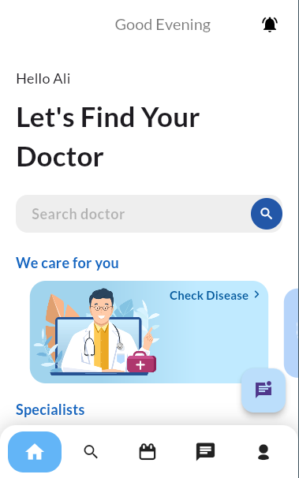
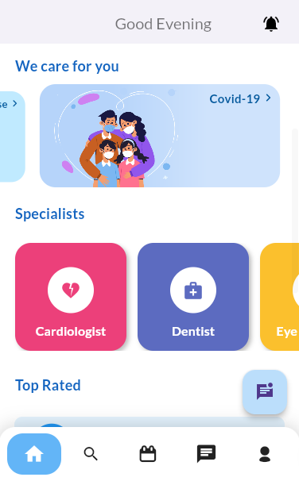
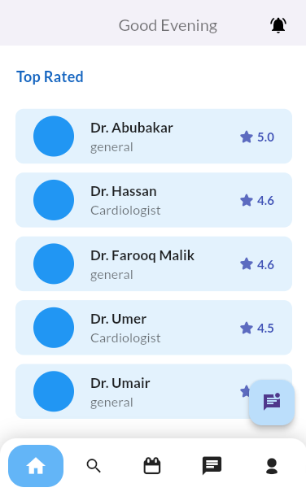
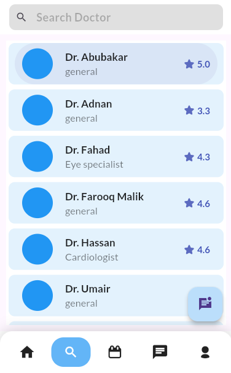
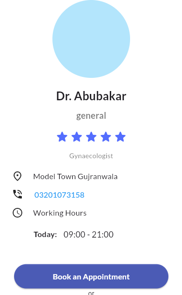
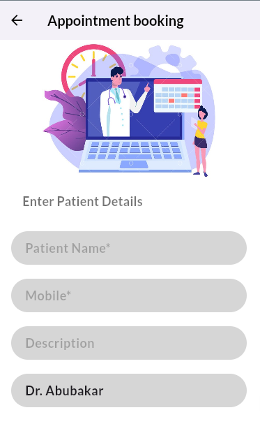
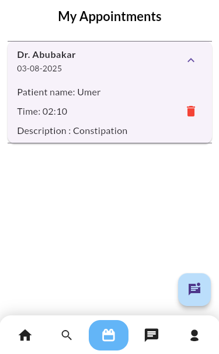
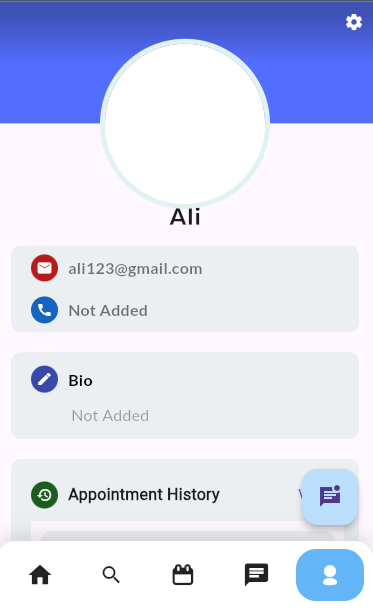
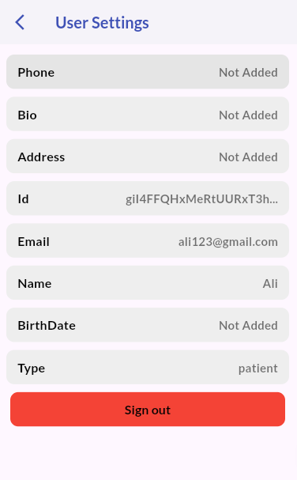
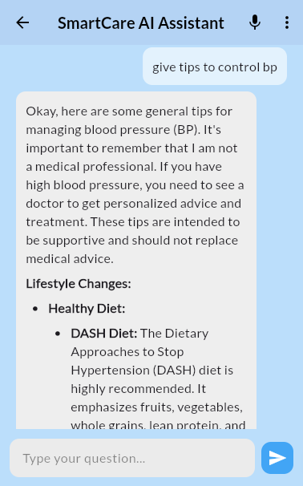

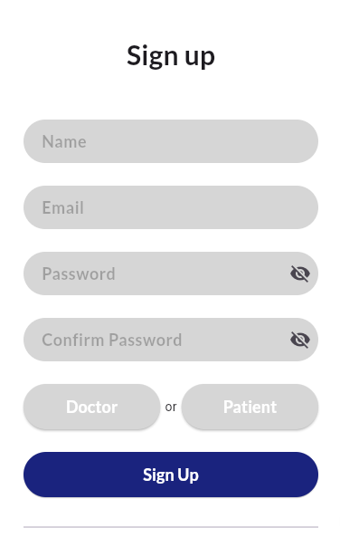
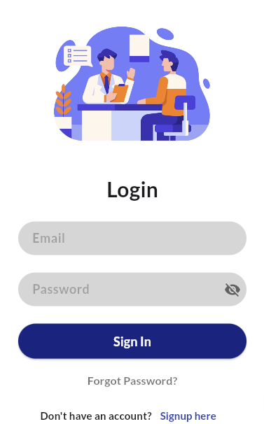
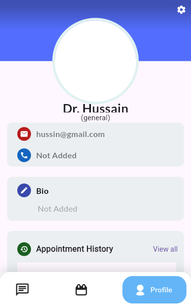
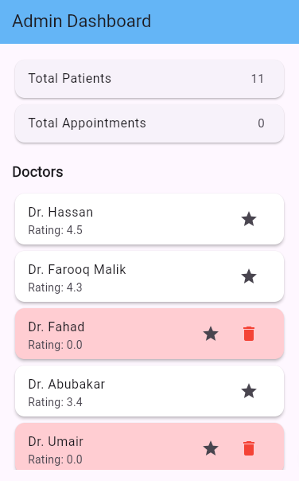
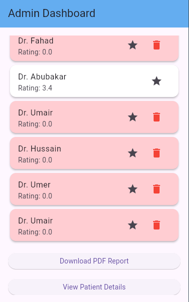

- 📅 Web View**  

https://healthappai.netlify.app/


## ✅ Getting Started

1. **Clone the repository:**
   ```bash
   git clone https://github.com/hassanali8-2003/health_app1.git

2. **Install dependencies:**

   ```bash
   flutter pub get
   ```

3. **Configure Firebase:**

   * Add `google-services.json` to `android/app/`
   * Add `GoogleService-Info.plist` to `ios/Runner/`
   * Enable Firebase services: Auth, Firestore, Storage

4. **Run the app:**

   ```bash
   flutter run
   


## 📂 Folder Structure (Simplified)

```
lib/
├── screens/
│   ├── chat/
│   ├── appointment/
│   └── home/
├── services/
├── models/
├── utils/
└── main.dart
```

---

## 👨‍💻 Developed By

**Hassan Ali**
🔗 [LinkedIn](https://www.linkedin.com/in/hassan-ali-258021283/)
🐙 [GitHub](https://github.com/hassanali8-2003)

---

## 📄 License

This project is licensed under the **MIT License**.

```
MIT License

Copyright (c) 2025 Hassan Ali

Permission is hereby granted, free of charge, to any person obtaining a copy
of this software and associated documentation files (the “Software”), to deal
in the Software without restriction, including without limitation the rights  
to use, copy, modify, merge, publish, distribute, sublicense, and/or sell  
copies of the Software, and to permit persons to whom the Software is  
furnished to do so, subject to the following conditions:

```

---

> Feel free to fork this project, contribute to it, or open issues!

